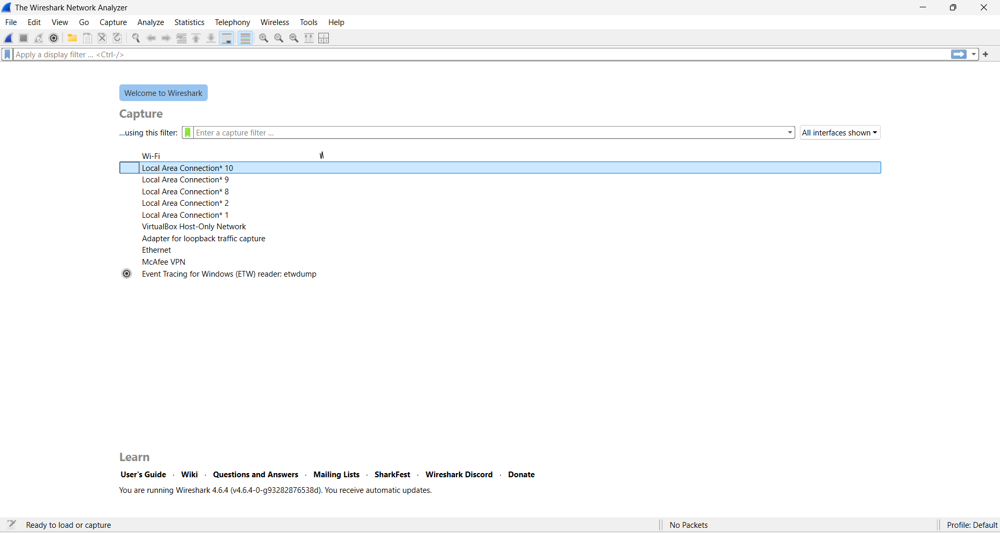
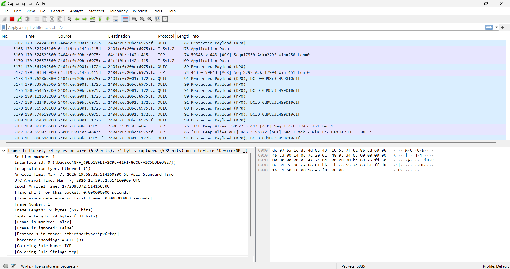
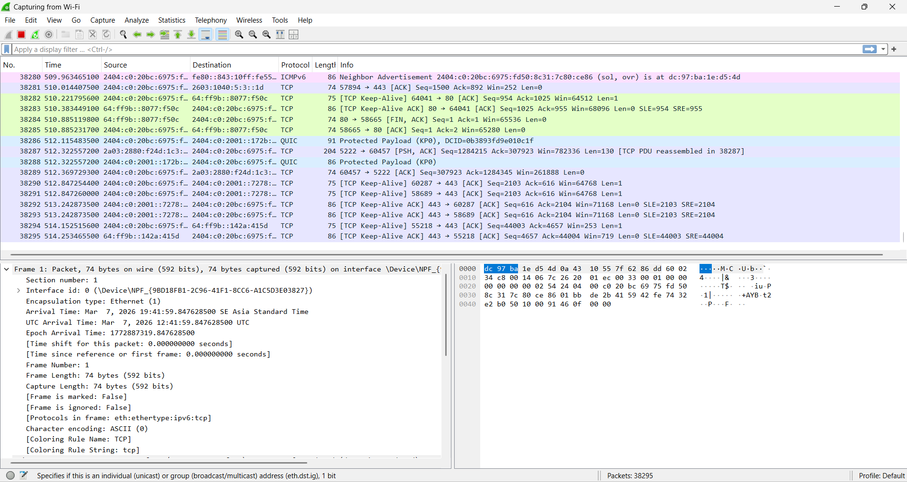
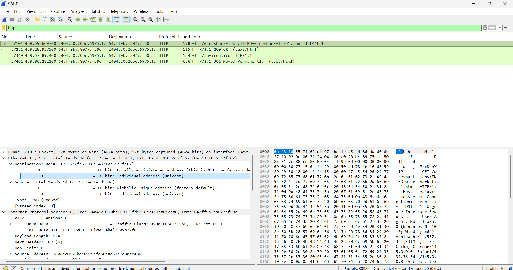
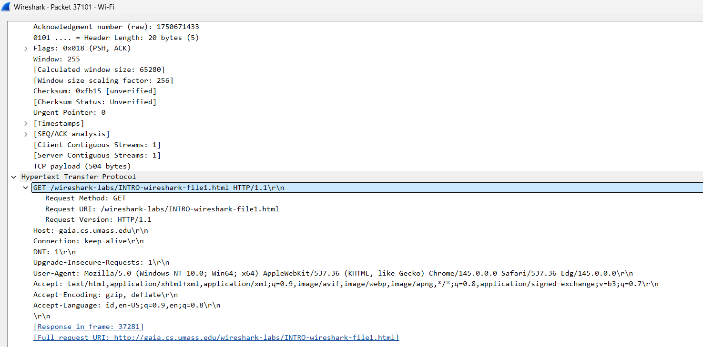
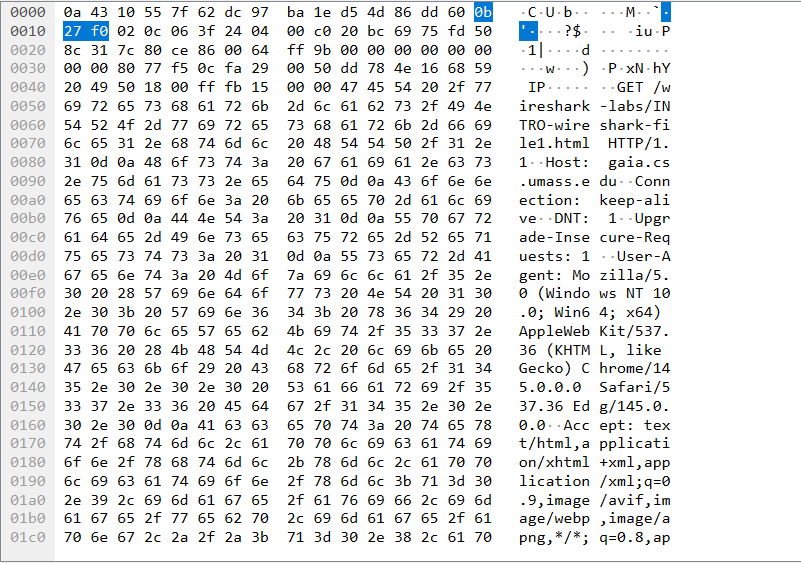

# Laporan Praktikum Jaringan Komputer - Modul 2
## Pengenalan Tools (Wireshark Basics)

### Identitas Praktikan
| Item | Keterangan |
|------|------------|
| **Nama** | Laura Chyndearni Saragih |
| **NIM** | 103072400049 |
| **Kelas** | IF-04-01 |

---

## 1. Tujuan Praktikum
Berdasarkan modul praktikum Jaringan Komputer Semester Genap 2025/2026, tujuan dari Modul 2 adalah:
1. Mahasiswa dapat melakukan instalasi tool yang digunakan (Wireshark).
2. Mahasiswa dapat menggunakan tool (Wireshark) untuk menangkap dan mengidentifikasi paket data.

---

## 2. Dasar Teori
### 2.1 Packet Sniffer
Wireshark merupakan aplikasi untuk mengamati pesan yang bertukar antara entitas protokol yang disebut dengan **Packet Sniffer**. Packet Sniffer menangkap ("Sniffs") pesan yang dikirim/diterima dari/oleh komputer anda. Sebuah Packet Sniffer bersifat pasif, hanya mengamati pesan tanpa mengirim atau menerima paket itu sendiri.

Struktur Packet Sniffer terdiri dari dua bagian utama:
1. **Packet Capture Library:** Menerima salinan dari setiap frame link layer yang dikirim/diterima oleh komputer.
2. **Packet Analyzer:** Menampilkan isi dari semua bidang dalam pesan protokol dengan memahami struktur pesan (Ethernet, IP, TCP, HTTP, dll).

### 2.2 Antarmuka Wireshark
Antarmuka Wireshark memiliki lima komponen utama:
1. **Command Menu:** Menu pull-down standar (File, Capture, dll).
2. **Packet Listing Window:** Ringkasan satu baris untuk setiap paket (No, Time, Source, Destination, Protocol, Info).
3. **Packet Header Details Window:** Rincian tentang paket yang dipilih (Frame, Ethernet, IP, TCP, HTTP).
4. **Packet Contents Window:** Menampilkan seluruh isi frame dalam format ASCII dan heksadesimal.
5. **Packet Display Filter Field:** Kolom untuk menyaring informasi yang ditampilkan berdasarkan protokol atau informasi lain.

---

## 3. Langkah Kerja
Berikut adalah langkah-langkah yang dilakukan selama praktikum Modul 2 (Test Run Wireshark):

1. **Persiapan:**
   - Memastikan komputer terhubung ke Internet (Ethernet atau WiFi).
   - Menjalankan browser web.
   - Menjalankan aplikasi Wireshark.

2. **Memulai Capture:**
   - Memilih menu `Capture` > `Interfaces`.
   - Memilih interface yang aktif (misal: Wi-Fi atau Ethernet) dan klik `Start`.

3. **Generasi Traffic:**
   - Saat Wireshark berjalan, mengakses URL berikut pada browser:
     `http://gaia.cs.umass.edu/wireshark-labs/INTRO-wireshark-file1.html`
   - Menunggu halaman web muncul (ucapan selamat sederhana).

4. **Menghentikan Capture:**
   - Mengklik tombol `Stop` (kotak merah) pada Wireshark.

5. **Analisis Paket:**
   - Mengetik `http` pada kolom filter dan menekan Enter.
   - Menemukan pesan **HTTP GET** yang dikirim ke server `gaia.cs.umass.edu`.
   - Memilih paket tersebut dan melihat detail protokol pada jendela *Packet Header Details*.
   - Meminimalkan detail Frame, Ethernet, IP, dan TCP (klik tanda `-` atau `>`).
   - Memaksimalkan detail protokol HTTP (klik tanda `+` atau `v`).

6. **Selesai:**
   - Keluar dari aplikasi Wireshark.

---

## 4. Hasil dan Pembahasan

### 4.1 Tampilan Awal Wireshark
Berikut adalah tampilan awal Wireshark saat pertama kali dibuka sebelum melakukan capture paket. Terlihat daftar interface jaringan yang tersedia.

*Gambar 1: Tampilan awal Wireshark (Welcome Screen).*

### 4.2 Memilih Interface Capture
Jendela pemilihan interface untuk memulai pengambilan paket. Interface yang dipilih adalah interface yang sedang aktif digunakan untuk koneksi internet.

*Gambar 2: Jendela Capture Interfaces pada Wireshark.*

### 4.3 Hasil Capture Paket
Setelah mengakses URL `http://gaia.cs.umass.edu/wireshark-labs/INTRO-wireshark-file1.html` dan menghentikan capture, berikut adalah daftar paket yang tertangkap. Terdapat banyak protokol yang berjalan di latar belakang meskipun hanya membuka satu halaman web.

*Gambar 3: Daftar paket (Packet List) setelah menghentikan capture.*

### 4.4 Filter Protokol HTTP
Untuk memudahkan analisis, dilakukan filtering menggunakan kata kunci `http` pada display filter. Hanya paket yang berkaitan dengan protokol HTTP yang ditampilkan.

*Gambar 4: Hasil filter paket menggunakan ekspresi "http".*

### 4.5 Analisis Detail Paket HTTP GET
Pada bagian ini, dipilih paket **HTTP GET** yang dikirim dari komputer klien ke server `gaia.cs.umass.edu`. Detail protokol ditampilkan secara hierarkis.

*Gambar 5: Detail paket HTTP GET dengan protokol lain diminimalkan.*

**Penjelasan Detail Paket:**
- **Frame:** Informasi fisik tentang paket yang ditangkap.
- **Ethernet II:** Informasi alamat MAC sumber dan tujuan.
- **Internet Protocol Version 4:** Informasi alamat IP sumber dan tujuan.
- **Transmission Control Protocol:** Informasi port sumber dan tujuan, serta nomor urut (sequence number).
- **Hypertext Transfer Protocol:** Informasi metode request (GET), host, dan user-agent.

### 4.6 Konten Paket (Hex & ASCII)
Jendela paling bawah menampilkan konten mentah dari paket dalam format heksadesimal dan ASCII.

*Gambar 6: Tampilan Packet Bytes (Hex dan ASCII).*

---

## 5. Kesimpulan
Berdasarkan praktikum Modul 2 ini, dapat disimpulkan bahwa:
1. **Wireshark** berhasil diinstal dan digunakan sebagai alat *packet sniffer* untuk menangkap lalu lintas jaringan.
2. Wireshark memiliki komponen utama yaitu *Packet Listing*, *Packet Details*, dan *Packet Bytes* yang memudahkan analisis protokol berlapis.
3. Fitur **Display Filter** sangat berguna untuk menyaring paket spesifik (misalnya hanya menampilkan traffic HTTP) di antara banyaknya paket yang tertangkap.
4. Praktikum ini menunjukkan bahwa satu aktivitas sederhana (membuka webpage) melibatkan banyak protokol lapisan bawah (Ethernet, IP, TCP) sebelum mencapai lapisan aplikasi (HTTP).
5. Pemahaman terhadap antarmuka Wireshark menjadi dasar penting untuk modul-modul selanjutnya (HTTP, DNS, TCP, UDP, dll).

---

## 6. Daftar Pustaka
1. Kurose, J.F., & Ross, K.W. (2021). *Computer Networking: A Top-Down Approach*, 8th Edition. Pearson.
2. Universitas Telkom. (2026). *Modul Praktikum Jaringan Komputer Semester Genap 2025/2026*. Fakultas Informatika.
3. Wireshark Foundation. (2024). *Wireshark User's Guide*. Retrieved from https://www.wireshark.org/docs/